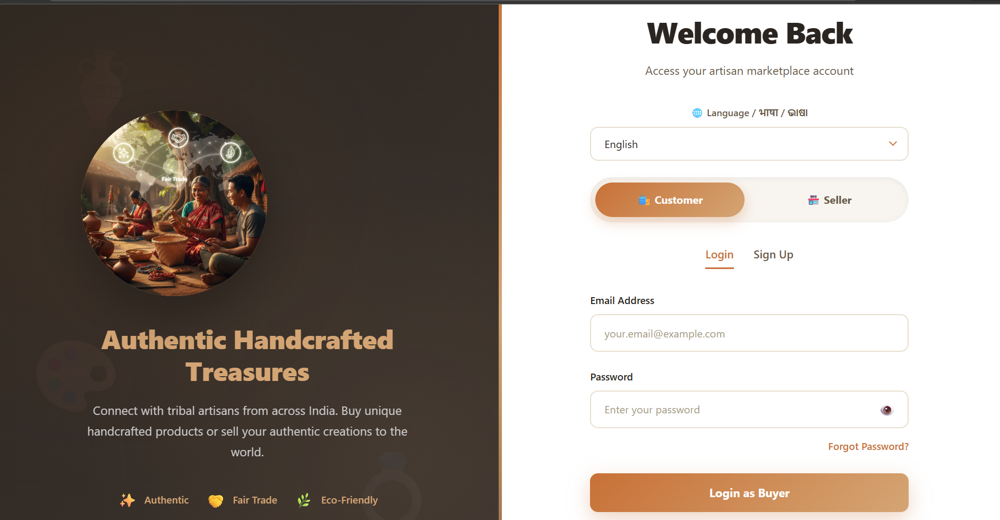
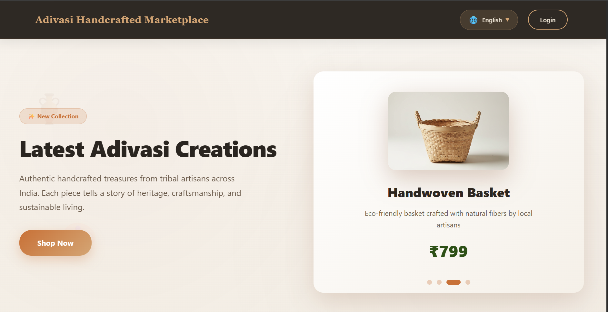
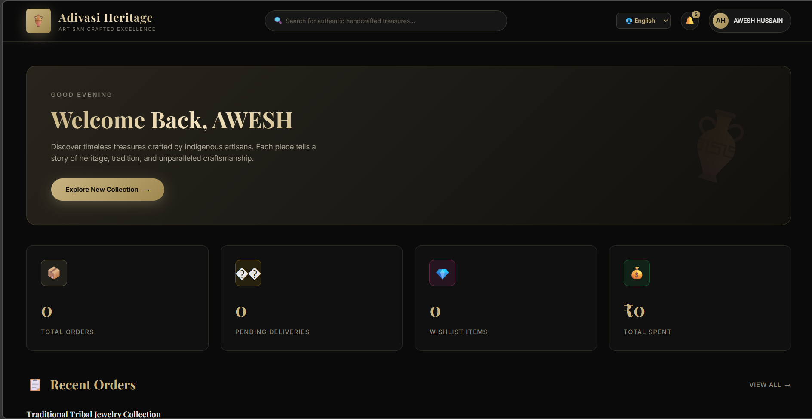

# 🛍️ Adivasi Market – E-commerce Platform  

📊 Empowering tribal artisans through a digital marketplace for handcrafted products  

## 🌐 Live Demo  
👉 https://aweshhussain-adivasi-ecommerce-plat.vercel.app/

## 📌 Overview  
**Adivasi Market** is a full-stack e-commerce platform developed as a semester project to support Adivasi and backward-class artisans. It provides a digital space to showcase and sell handcrafted products while promoting cultural preservation and inclusive digital participation.

The platform focuses on:
- Accessibility for rural artisans  
- Fair income opportunities  
- Cultural heritage promotion  
- Direct connection between artisans and customers  

---

## 📸 Application Preview  

| Login | Dashboard | Buyer Homepage |
|-------|----------|----------------|
|  |  |  |

---

## 🚀 Features  

### 🔤 Multilingual Support  
- Supports multiple languages for wider accessibility across regions  

### 🛒 E-commerce Marketplace  
- Product listings with price details  
- High-quality images with 360° preview *(if implemented)*  
- Wishlist and buy options  

### 👨‍🎨 Artisan Profiles  
- Dedicated profiles for each artisan  
- Includes name, region, craft type, and background story  

### 🔐 Backend & Database  
- Backend developed using Flask  
- Data stored using IBM Cloudant database  
- Handles users, products, and artisan data  

### 🚛 Delivery & Refund Workflow  
- Defined delivery process  
- Return and refund conditions  
- Handling damaged or incorrect products  

---

## 🛠️ Tech Stack  

- **Frontend:** HTML, CSS, JavaScript  
- **Backend:** Python (Flask)  
- **Database:** IBM Cloudant  
- **Cloud:** IBM Cloud  

---

## 📂 Data Handling  

### Stored Data:
- User details  
- Product information  
- Artisan profiles  
- Transaction-related data  

---

## ⚙️ How It Works  

1. Users visit the platform  
2. Browse products listed by artisans  
3. View artisan profiles and product details  
4. Add items to wishlist or proceed to purchase  
5. Backend processes requests using Flask  
6. Data is stored and retrieved from Cloudant database  

---

## 🎯 Project Purpose  

To leverage technology for empowering tribal artisans by providing them with a digital platform to sell their products, preserve cultural identity, and reach a broader audience.

---

## 💡 Future Enhancements  

- 🤖 AI-based product recommendations (IBM Watson)  
- 💳 Payment gateway integration  
- 📦 Inventory management system  
- 🚚 Real-time delivery tracking  
- 📱 Mobile application version  
- ✅ Product authenticity certification system  

---

## ⚠️ Note  
Many advanced features are currently under development. Future updates will include authentication systems for verifying product originality and enhancing user trust.

---

## 👨‍💻 Author  

**Awesh Hussain**  
GitHub: https://github.com/AweshHussain  
